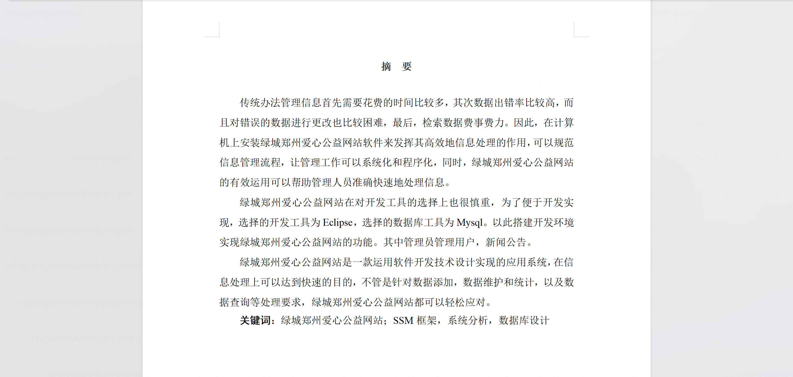
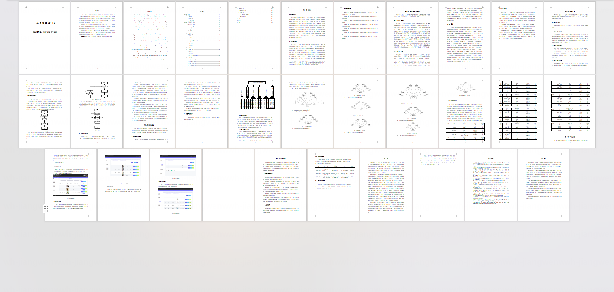
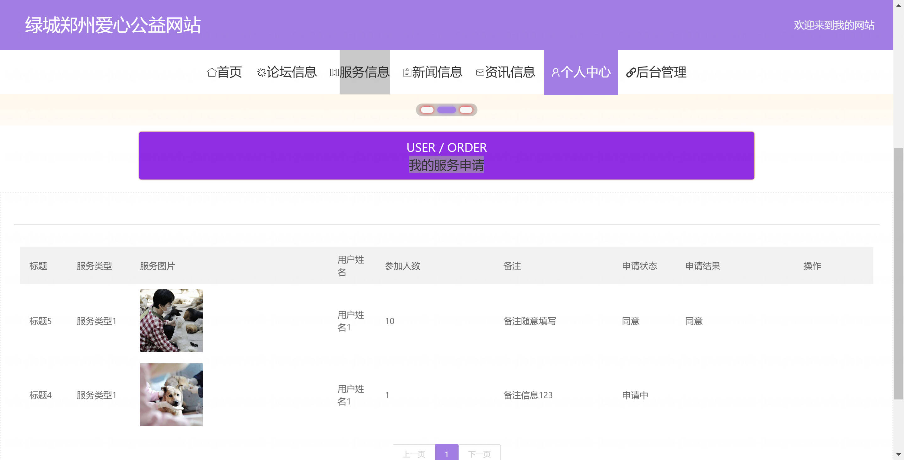
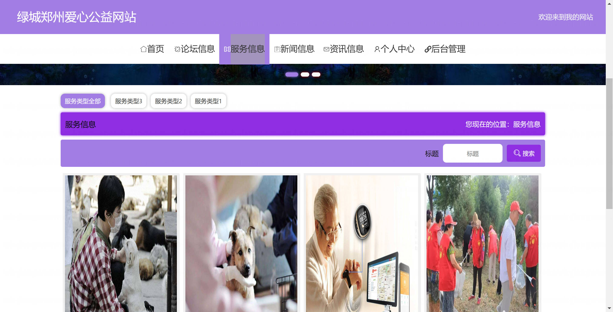
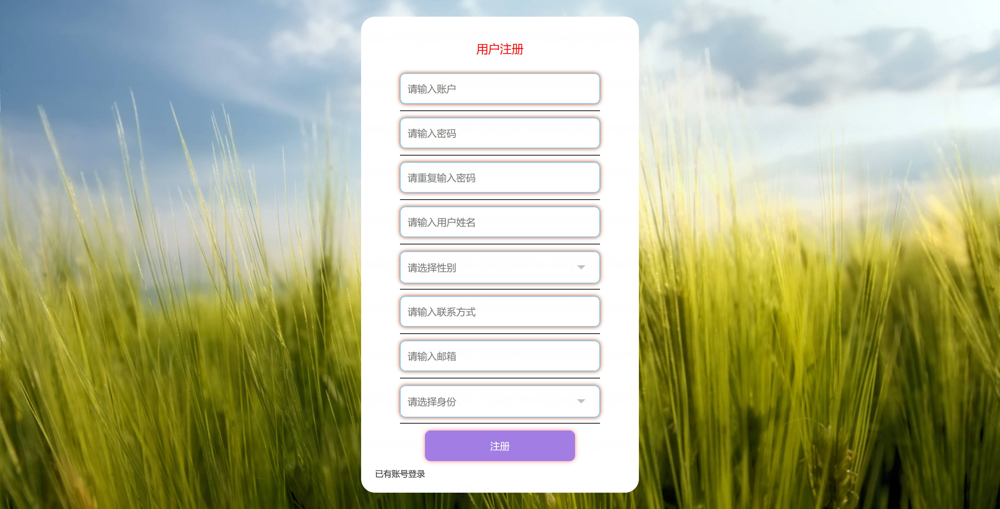
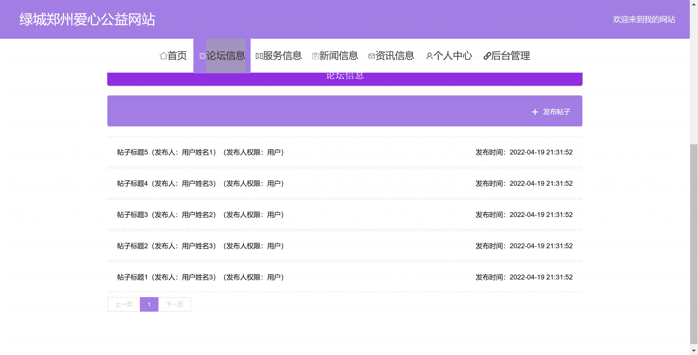
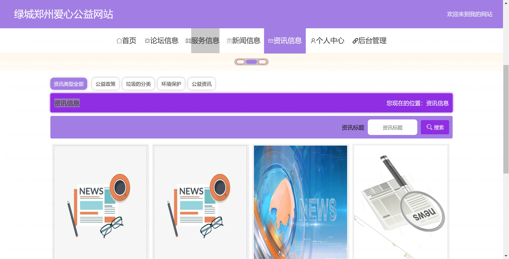
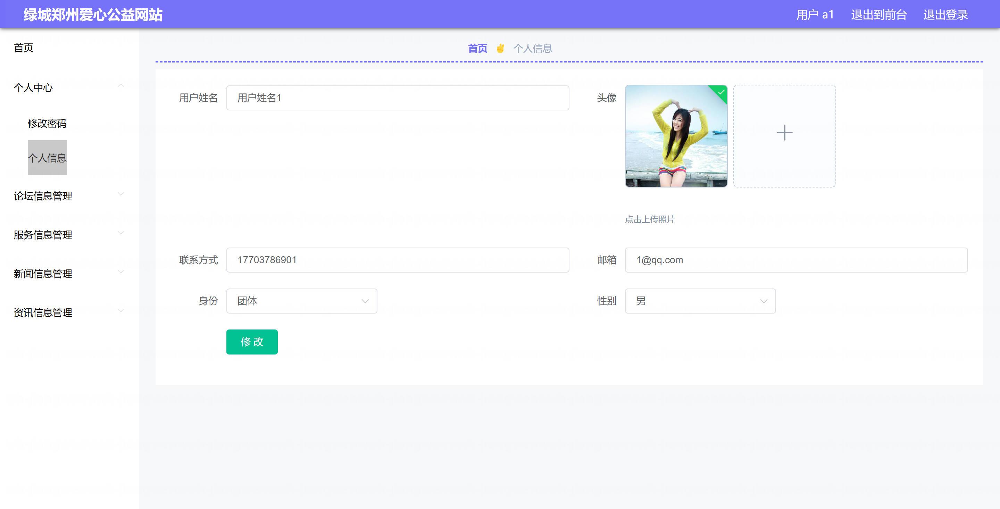
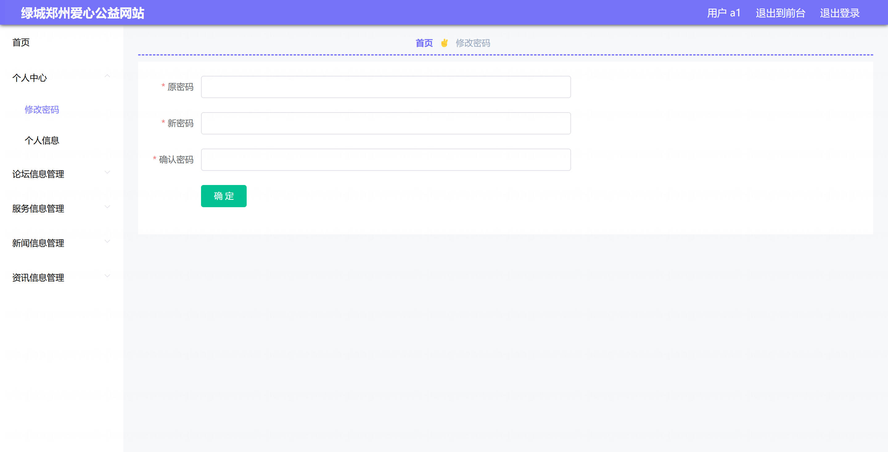
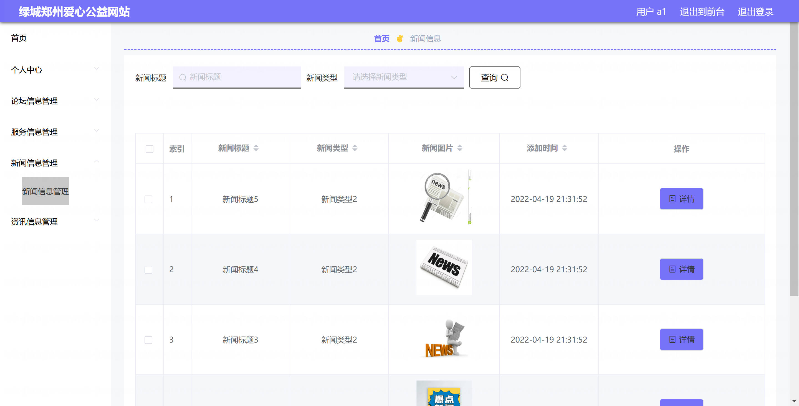

基于Springboot的绿城郑州爱心公益管理系统（程序+论文）
=

### 完整代码获取地址：从戎源码网 ([https://armycodes.com/](https://armycodes.com/))
### 作者微信：19941326836  QQ：952045282 
### 承接计算机毕业设计、Java毕业设计、Python毕业设计、深度学习、机器学习
### 选题+开题报告+任务书+程序定制+安装调试+论文+答辩ppt 一条龙服务
### 所有选题地址https://github.com/nature924/allProject

一、项目介绍
---

基于 Spring Boot 的绿城郑州爱心公益管理系统，分为后台管理端（管理员）与前端用户端（普通用户），主要功能如下：

管理员（后台）：系统的管理角色，负责全站数据维护与审核。主要功能：
系统管理：登录、登出、修改密码、获取/修改个人信息、会话/token 管理。
用户管理：用户列表/分页、查看/新增/修改/删除用户、重置密码、获取在线/会话信息。
内容管理（CMS）：新闻、资讯（Zixun）管理：列表/分页、详情、添加、编辑、删除。
论坛管理：帖子管理（列表/详情/新增/编辑/删除）、审核/回复/级联父子关系处理。
服务管理：服务信息（CRUD）、服务订单管理（列表、详情、审核、删除）。
留言/评价管理：服务留言管理、查看与维护。

普通用户（前端）：面向公众的使用者，主要功能：
认证与个人中心：注册、登录、登出、修改密码、查看/编辑个人信息、查看会话。
内容浏览与互动：查看新闻/资讯列表与详情、参与论坛（发帖/查看/评论）
服务预约与订单：查看服务信息、提交服务申请（下单）、查看/管理个人订单。
留言与反馈：对服务发布留言、查看留言记录。

二、项目技术
---
- 编程语言：Java
- 数据库：MySQL
- 项目架构：B/S架构
- 前端技术：JSP
- 后端技术：Spring、SpringMVC、MyBatis

三、运行环境
---
- 操作系统：Windows、macOS都可以
- JDK版本：JDK1.8以上都可以
- 开发工具：IDEA、Ecplise、Myecplise都可以
- 数据库: MySQL5.7以上都可以
- Tomcat：任意版本都可以
- Maven：任意版本都可以

四、运行截图
---
### 论文截图：

### 程序截图：

